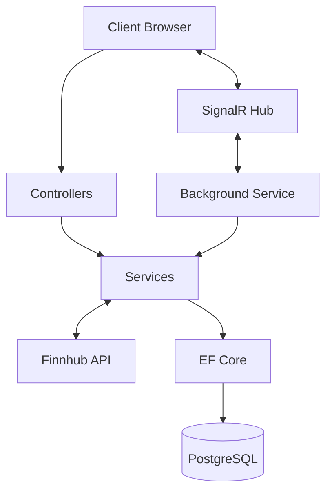

[English](README.md)

# Stock Alert API
Ein Echtzeit-System zur Überwachung von Aktienkursen mit sofortigen Benachrichtigungen, das unter Verwendung von Clean Architecture und modernen .NET-Technologien entwickelt wurde.

### Projektübersicht

Diese API ermöglicht es Benutzern:
- Preisalarme für Aktien zu setzen (z. B. "Benachrichtige mich, wenn AAPL 200 $ erreicht")
- Echtzeit-Benachrichtigungen über SignalR zu erhalten, wenn Preisziele erreicht werden
- Aktienkurse durch einen Hintergrunddienst zu überwachen, der in die Finnhub-API integriert ist
- Alarme mit sicherer JWT-Authentifizierung zu verwalten

---

## Architecture


**Clean Architecture-Schichten:**
- **Core**: Domänenentitäten & Schnittstellen (keine Abhängigkeiten)
- **Application**: Geschäftslogik & Hintergrunddienste
- **Infrastructure**: EF Core, externe APIs, Sicherheit
- **API**: Controller, SignalR-Hubs, DTOs

---

### Hauptmerkmale

- ✅ **JWT-Authentifizierung**: Sichere Benutzerregistrierung und Anmeldung
- ✅ **Echtzeit-Benachrichtigungen**: SignalR-WebSocket-Verbindungen
- ✅ **Hintergrundverarbeitung**: Automatisierte Preisüberwachung im Minutentakt
- ✅ **Externe API-Integration**: Finnhub-Aktienkursdaten
- ✅ **Clean Architecture**: Testbares und wartbares Design
- ✅ **Docker-Unterstützung**: Bereitstellung mit einem einzigen Befehl
- ✅ **Duplikatprävention**: Verhindert identische Alarme

---

### Technologie-Stack

| Kategorie | Technologie |
|---|---|
| **Framework** | ASP.NET Core 8.0 |
| **Datenbank** | PostgreSQL 16 |
| **ORM** | Entity Framework Core 8.0 |
| **Echtzeit** | SignalR |
| **Authentifizierung** | JWT Bearer |
| **Externe API** | Finnhub Stock API |
| **Containerisierung** | Docker + Docker Compose |

---

### Schnellstart

#### Voraussetzungen
- [.NET 8 SDK](https://dotnet.microsoft.com/download)
- [Docker Desktop](https://www.docker.com/products/docker-desktop)
- [Finnhub API Key](https://finnhub.io/) (kostenlose Stufe)

Option 1: Docker (Empfohlen)
``` bash
1. Repository klonen
git clone https://github.com/[your-username]/StockAlertApi.git
cd StockAlertApi
2. .env-Datei erstellen
echo "FINNHUB_API_KEY=your_api_key_here" > .env
3. Mit Docker starten
docker-compose up -d
```
API available at: http://localhost:5000/swagger

Option 2: Manual Setup
``` bash
1. Configure API Key (User Secrets)
cd src/StockAlertApi.API
dotnet user-secrets set "Finnhub:ApiKey" "your_api_key_here"
2. Start PostgreSQL
docker run -d -p 5432:5432 -e POSTGRES_PASSWORD=postgres postgres:16
3. Apply migrations
dotnet ef database update --project ../StockAlertApi.Infrastructure
4. Run API
dotnet run
```

API Usage
1. Register
``` http
POST /api/auth/register
Content-Type: application/json
{
"username": "testuser",
"email": "test@test.com",
"password": "Test123!"
}
```
2. Login & Get Token
``` http
POST /api/auth/login
Content-Type: application/json
{
"username": "testuser",
"password": "Test123!"
}
```
Response:
``` json
{
"token": "eyJhbGciOiJIUzI1NiIs...",
"userId": "...",
"username": "testuser"
}
```
3. Authorize in Swagger

Click "Authorize" button
Paste token (without "Bearer" prefix)

4. Create Stock
``` http
POST /api/stocks
Authorization: Bearer {token}
{
"tickerSymbol": "AAPL",
"companyName": "Apple Inc."
}
```
5. Create Alert
``` http
POST /api/alerts
Authorization: Bearer {token}
{
"stockId": "...",
"targetPrice": 200.50,
"direction": 1
}
```
Direction: 1 = Above, 2 = Below

Real-time Notifications
Connect to SignalR hub for live alerts:
``` javascript
const connection = new signalR.HubConnectionBuilder()
.withUrl("/alertHub?userId={your-user-id}")
.build();
connection.on("AlertTriggered", (data) => {
console.log(Alert: ${data.stockSymbol} reached ${data.currentPrice});
});
connection.start();
```
Test page available at: http://localhost:5000/test.html


- **SignalR**: Server-zu-Client-Echtzeitkommunikation
- **Background Services**: Langlebige Aufgaben mit IHostedService
- **Clean Architecture**: Trennung von Verantwortlichkeiten
- **EF Core Migrations**: Versionskontrollierte Datenbankschemas
- **JWT-Sicherheit**: Zustandslose Authentifizierung
- **Docker**: Containerisierung und Orchestrierung

## Technische & Architektonische Highlights

- **Clean Architecture:** Das Projekt ist nach den Prinzipien der Clean Architecture strukturiert, wodurch die Verantwortlichkeiten in die Schichten `Core`, `Application`, `Infrastructure` und `API` getrennt werden, was eine hohe Wartbarkeit und Testbarkeit gewährleistet.
- **Echtzeit-Funktionalität:** Nutzt **SignalR**, um Preisalarm-Benachrichtigungen in Echtzeit vom Server direkt an verbundene Clients zu senden.
- **Hintergrundverarbeitung:** Ein gehosteter `BackgroundService` läuft periodisch, um externe Daten abzurufen und Alarme auszulösen, was die Verwaltung von asynchronen, langlebigen Aufgaben demonstriert.
- **Secure by Design:** Implementiert **JWT-basierte Authentifizierung** zum Schutz von Endpunkten und enthält Geschäftslogik zur Vermeidung von Datenduplikaten.
- **Containerisierung:** Die Anwendung ist vollständig mit **Docker** containerisiert und mit `docker-compose` orchestriert, was eine konsistente und einfache Bereitstellung ermöglicht.
- **Externe API-Integration:** Demonstriert die Nutzung einer RESTful-Drittanbieter-API (z. B. Finnhub) zum Abrufen von realen Finanzdaten.
 